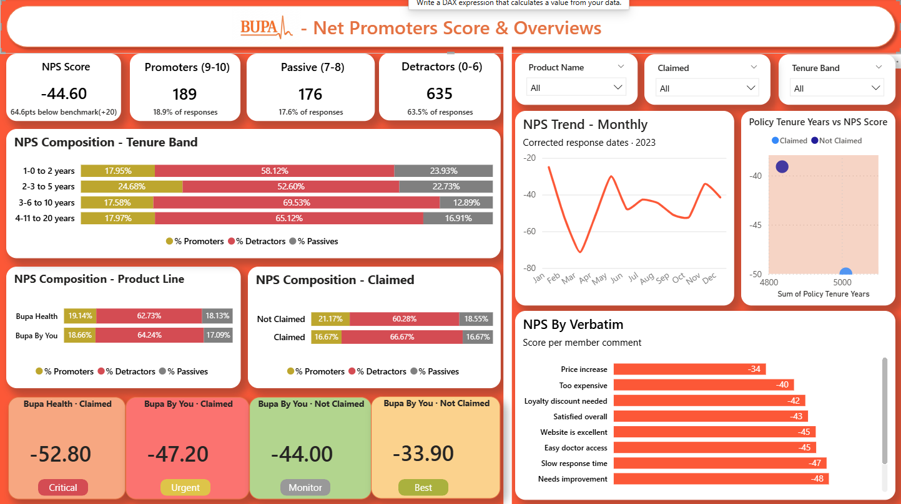
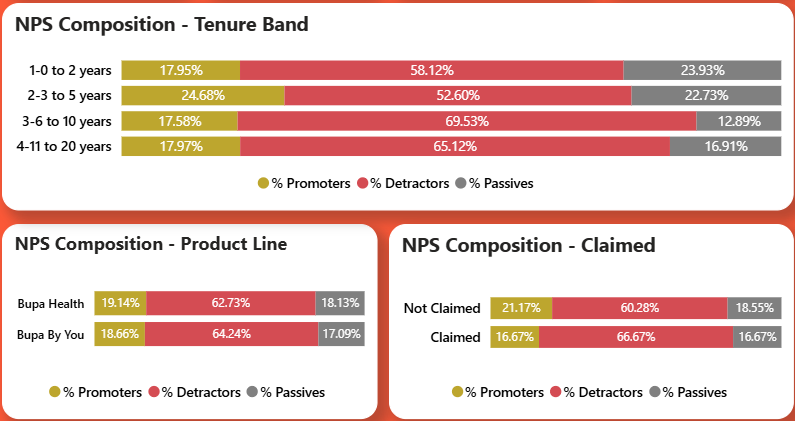
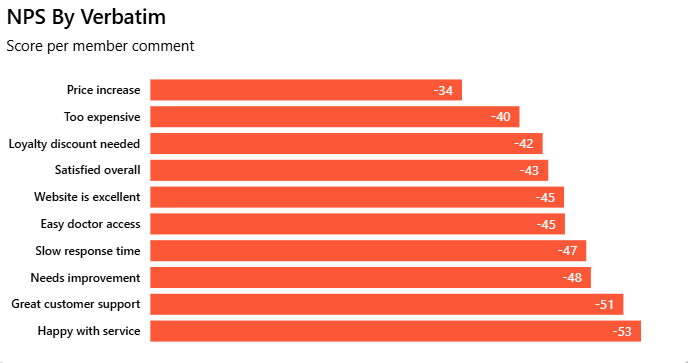

# Bupa NPS Analysis

## Overview
This project presents a Bupa Net Promoter Score (NPS) analysis built to understand customer feedback, identify dissatisfaction themes, and evaluate performance across key segments. It helps transform raw customer responses into clear business insights for better decision-making.

## Problem Statement
Bupa needed a clear and structured way to analyze customer feedback so the business could understand NPS performance, recurring service issues, and improvement opportunities. This project addresses that need by turning survey responses and verbatim comments into a business-focused analysis.

## Objectives
- Analyze customer NPS data visually and clearly.
- Identify key dissatisfaction themes from verbatim feedback.
- Compare performance across product line, tenure band, and claimed status.
- Summarize important business metrics for reporting.
- Support better customer experience decisions with actionable insights.

## Tools Used
- Microsoft Excel
- PDF documentation
- Dashboard visualization
- Business analysis reporting

## Dashboard Features
- Overall NPS score view.
- Promoter, passive, and detractor breakdown.
- Product-wise analysis.
- Tenure-based analysis.
- Claimed vs not claimed comparison.
- Verbatim theme analysis.
- Clear visual reporting workflow.

## Files Included
- `data/BUPA-Analysis.xlsx` – Main source dataset.
- `documents/Business-Requirements-Document-BRD-Bupa-NPS-Analysis.pdf` – Project requirements and business context.
- `documents/BUPA-Project-Analysis.pdf` – Final analysis and dashboard summary.
- `assets/` – Dashboard preview images.

## Key Insights
- The overall NPS score is -44.60.
- Detractors are significantly higher than promoters.
- Claimed customers show weaker NPS performance than not claimed customers.
- Major dissatisfaction themes include slow response time, price increase, and loyalty discount concerns.
- Visual analysis makes it easier to understand customer sentiment at a glance.

## Recommendations
- Improve response time in customer service and claims journeys.
- Focus on reducing detractor volume through targeted actions.
- Monitor claimed customer segments more closely.
- Track dissatisfaction themes and assign ownership for resolution.
- Expand reporting with more trend-based analysis over time.

## Repository Structure
```text
bupa-nps-analysis/
├── README.md
├── LICENSE
├── .gitignore
├── data/
│   └── BUPA-Analysis.xlsx
├── documents/
│   ├── Business-Requirements-Document-BRD-Bupa-NPS-Analysis.pdf
│   └── BUPA-Project-Analysis.pdf
├── assets/
│   ├── dashboard-overview.png
│   ├── nps-by-product-line.png
│   ├── nps-by-tenure-band.png
│   └── nps-by-verbatim.png
```

## How to Use
1. Open the Excel file to review the source data.
2. Read the BRD to understand the business problem and scope.
3. Review the project analysis PDF for the final insights.
4. Check the screenshots for a quick visual preview of the dashboard.

## Project Outcome
This project demonstrates skills in data analysis, dashboard design, reporting, and business analysis. It shows how customer feedback can be converted into meaningful insights that support business improvement.

## Future Improvements
- Add time-based trend analysis.
- Include deeper segmentation across customer groups.
- Improve dashboard interactivity.
- Expand the analysis with more customer experience measures.

## Screenshots





